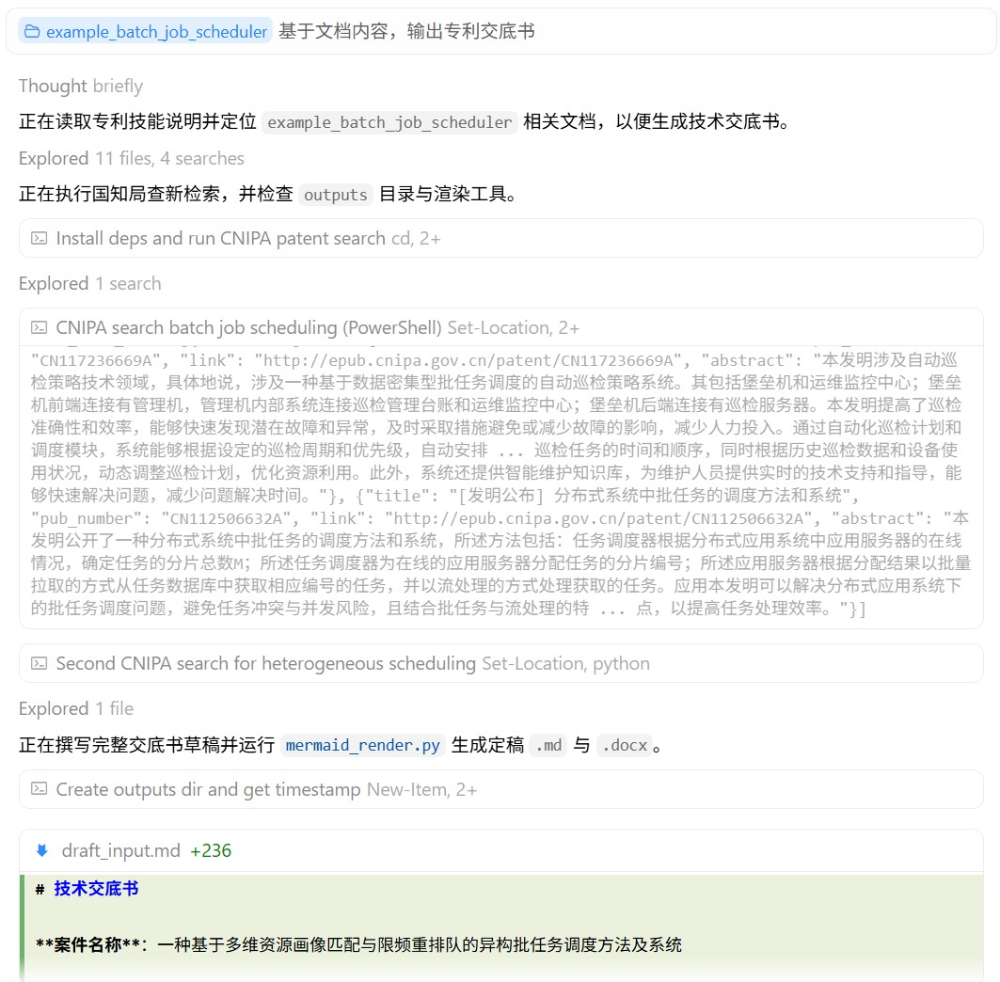

<div align="center">

# 中国专利.skill

> 从项目文档到**可交付的技术交底书**：专利点**资产清单与取舍门禁**、**查新优先国知局公布公告站**、脱敏成文、**公式范式校验**与自检闭环、**版本化目录交付**。

[](LICENSE)
[](https://www.python.org/)
[](https://playwright.dev/)
[](https://agentskills.io)

<br>

有设计文档和代码，但**专利点还没梳**？<br>
交底书要**系统框图、流程图**，还要**代理人能直接改的 Word**？<br>
定稿之后还要**多轮补材料、纠错**，并希望**文件修改追溯**？<br>
国知局公布站检索，期望 **次次爬成功、精准检索**？

**本 Skill 按 AgentSkills 约定编排全流程，`SKILL.md` + `prompts/` 分步可读可迭代。**

[功能特性](#功能特性) · [安装](#安装) · [使用](#使用) · [项目结构](#项目结构) · [示例](#示例) · [运行效果](#运行效果) · [参考文档](#参考文档) · [详细安装说明](INSTALL.md) · [技能入口](SKILL.md)

</div>

---

## 功能特性

<!-- 使用 HTML 表格：GitHub 上 Markdown 管道表会因右侧长路径/URL 把左列挤窄导致中文换行 -->
<table>
<colgroup>
<col width="1%">
<col>
</colgroup>
<thead>
<tr><th align="left" nowrap width="1%">能力</th><th align="left">说明</th></tr>
</thead>
<tbody>
<tr><td nowrap width="1%"><strong>项目扫描</strong></td><td>按优先级读文档 / 代码；<code>.docx</code> / <code>.pptx</code> 先转 Markdown 再扫（见 <code>prompts/project_scan.md</code>）</td></tr>
<tr><td nowrap width="1%"><strong>专利点资产清单</strong></td><td>候选盘点 + <strong>轻量相似专利初筛</strong>（Google Patents / WebSearch）+ 评分 + 四类分类（建议申请 / 可合并 / 暂不适合 / 商业秘密），<strong>用户取舍确认后才成文</strong>（<code>patent_points_analyzer.md</code>）</td></tr>
<tr><td nowrap width="1%"><strong>查新</strong></td><td><strong>优先</strong> <a href="http://epub.cnipa.gov.cn/">国知局 · 中国专利公布公告</a>（<code>tools/cnipa_epub_search.py --type invention|utility_model</code>，按专利类型过滤）；异常或无果时降级 WebSearch（Google 学术 / Patents）。著录与外链写入 3.1/3.3（<code>prior_art_search.md</code>）</td></tr>
<tr><td nowrap width="1%"><strong>交底书成稿</strong></td><td>所内 docx 模版对齐 + <strong>mermaid</strong> 系统框图与流程图（<strong>Playwright 渲染，免 Node/mmdc</strong>）；公式经 <code>formula_plan.yaml</code> 范式计划 + <code>check_formula_plan.py</code> 可算性校验后，转 <strong>Word 原生 OMML 公式</strong>；成文遵循<strong>标题贯穿与领域术语</strong>规则（§7.9）</td></tr>
<tr><td nowrap width="1%"><strong>交付命名</strong></td><td>凡落盘交付：<code>{案件名}_{YYYYMMDDHHmmss}.md</code> 与同名 <code>.docx</code>，写入 <code>vN-简短说明-时间戳/</code> <strong>版本目录</strong>并维护 <code>版本索引.md</code>（<code>disclosure_builder.md</code> §7.3、<code>versioned_output.md</code>）</td></tr>
<tr><td nowrap width="1%"><strong>自检</strong></td><td>逻辑闭环、公式与参数一致（<code>disclosure_self_check.md</code>，不写入正文）</td></tr>
<tr><td nowrap width="1%"><strong>迭代</strong></td><td><strong>合并</strong> / <strong>纠正</strong>（含<strong>术语族替换</strong>）另存下一版本目录；<code>交底书修订对话记录.md</code> 逐条追加、<code>版本索引.md</code> 同步更新（<code>iteration_context.md</code>、<code>iteration_dialog_log.py</code>）</td></tr>
<tr><td nowrap width="1%"><strong>专利簇清单</strong></td><td>一次交付 2 件及以上相关专利时，额外生成通俗说明清单：整体目的、每件侧重点、方法/系统区别、交叉边界与阅读路线（<code>patent_family_explainer.md</code>）</td></tr>
</tbody>
</table>

**Office 抽取**：`.docx` / `.pptx` 先用本仓库 `docx_to_md.py` / `pptx_to_md.py` 转为 Markdown 再扫描（见 `SKILL.md`）。

**Python 依赖**：根目录 [`requirements.txt`](requirements.txt) — `pip install -r requirements.txt`（含 `latex2mathml`、`PyYAML`、`playwright`；`matplotlib` 为可选，仅公式 OMML 失败且用户确认后安装）。

**浏览器**：查新与 mermaid 出图共用 Playwright，优先用系统 Chrome/Edge（`python tools/browser.py --probe` 探测）；仅无系统浏览器时 `python -m playwright install chromium`。**无需 Node.js / npm / mmdc**。详见 [INSTALL.md](INSTALL.md)、[tools/README.md](tools/README.md)。

---

## 安装

### Claude Code

> 请在 **git 仓库根目录** 或全局 skills 路径下放置本目录，使 `SKILL.md` 位于技能文件夹根级（与 [INSTALL.md](INSTALL.md) 一致）。

```bash
# 示例：安装到当前项目的 skills 目录
mkdir -p .claude/skills
git clone <本仓库 URL> .claude/skills/patent-disclosure-skill
```

### Cursor

将本仓库完整内容放到 Cursor 约定的 skills 路径（见 [INSTALL.md](INSTALL.md) 表格），重启后在 **Settings → Rules** 中确认技能已被发现。

### 依赖

```bash
# 基础（Office 转换、交底书相关 Python 包）
pip install -r requirements.txt
```

```bash
# 可选：无系统 Chrome/Edge 时才需要（查新与 mermaid 共用）
python tools/browser.py --probe   # 先探测；ok=true 时禁止再装浏览器
python -m playwright install chromium
```

图示定稿由 **Playwright + 内置 `tools/vendor/mermaid.min.js`** 渲染，**无需 Node.js / npm / mmdc**（详见 [tools/README.md](tools/README.md)）。

---

## 使用

在 Agent 中用自然语言描述需求即可，例如：

- 专利挖掘、专利点、**技术交底书**、查新、现有技术对比  
- 斜杠指令（视宿主配置）：如 `/patent-disclosure-skill`、`/交底书`

建议同时说明 **项目路径** 或 **技术主题**（与 `SKILL.md` 中 `argument-hint` 一致）。  
**查新（Step 5）** 会优先通过 [中国专利公布公告](http://epub.cnipa.gov.cn/) 检索中国专利公开信息，再按需补充其他来源；流程见 `prompts/prior_art_search.md`。  
在**已有交底书文件**上补充材料或纠错时，无需说「迭代」——技能会按 `merger.md` / `correction_handler.md` 处理；细则见 [SKILL.md](SKILL.md)。

---

## 项目结构

本仓库遵循 [AgentSkills](https://agentskills.io)，根目录即一个 skill：

```
patent-disclosure-skill/
├── SKILL.md                    # 入口：触发条件、工具表、步骤与 prompts 引用
├── prompts/                    # 分步模板（Agent Read 后遵循）
│   ├── intake.md
│   ├── project_scan.md
│   ├── patent_points_analyzer.md   # 专利点资产清单 + 轻量初筛 + 取舍门禁
│   ├── prior_art_search.md
│   ├── disclosure_preview.md
│   ├── disclosure_builder.md
│   ├── disclosure_self_check.md
│   ├── versioned_output.md         # 版本化目录规范（vN-说明-时间戳 + 版本索引）
│   ├── patent_family_explainer.md  # 多件交付的专利簇通俗说明清单
│   ├── iteration_context.md
│   ├── merger.md
│   ├── correction_handler.md
│   └── template_reference.md
├── references/                 # formulas/paradigms.yaml 公式范式库；schemas/formula_plan 合同；patent_type_search.yaml 类型检索映射
├── tools/                      # mermaid_render（Playwright）、md_to_docx（OMML）、math_to_omml、formula_*（范式/校验）、browser、docx_to_md、pptx_to_md；国知局 cnipa_epub_*（查新）；iteration_dialog_log 等
├── docs/                       # PRD、仓库结构说明、运行效果截图（效果例-*.jpg）
├── examples/                   # 原材料示例（如 example_batch_job_scheduler/knowledge/）
├── outputs/                    # 用户产出，整目录 .gitignore
├── requirements.txt
├── LICENSE
├── INSTALL.md
└── .gitignore
```

---

## 示例

虚构扫描原材料见 [examples/README.md](examples/README.md)（如 `examples/example_batch_job_scheduler/knowledge/`）。  
专利点、查新笔记、交底书等**完整产物**由流程生成到本地 **`outputs/{案件标识}/`**。

---

## 运行效果

**初版生成**（首次落盘交付）



**迭代更新**（合并/纠正后再交付，多版本并存 + 对话记录）


---

## 参考文档

- [技能入口与 Agent 流程](SKILL.md)（触发条件、`prompts/` 映射、工具表）
- [详细安装说明](INSTALL.md)（Claude Code / Cursor 路径）
- [图示与转换脚本](tools/README.md)（mermaid / Playwright、Word 导出与 OMML 公式、公式范式校验、国知局 epub 查新工具）
- [示例案件与原材料说明](examples/README.md)
- [产品流程与目录约定](docs/PRD.md)
- [工程结构说明](docs/skill-structure.md)
- [交底书模版细则](prompts/template_reference.md)

---

## 支持作者

如果这个 Skill 帮您节省了写交底书的时间，可以请我喝杯咖啡☕随缘支持，感谢感谢🙏🙏

<div align="left">

<table>
<tr>
<td valign="middle" align="left" style="padding-right: 16px;">


</td>
<td valign="middle" align="left">

<a href="https://www.star-history.com/?repos=handsomestWei%2Fpatent-disclosure-skill&type=date&legend=top-left">
  <picture>
    <source media="(prefers-color-scheme: dark)" srcset="https://api.star-history.com/chart?repos=handsomestWei/patent-disclosure-skill&type=date&theme=dark&legend=top-left" />
    <source media="(prefers-color-scheme: light)" srcset="https://api.star-history.com/chart?repos=handsomestWei/patent-disclosure-skill&type=date&legend=top-left" />
    
  </picture>
</a>

</td>
</tr>
</table>

</div>

---

<div align="center">

MIT License © [handsomestWei](https://github.com/handsomestWei/)

</div>
