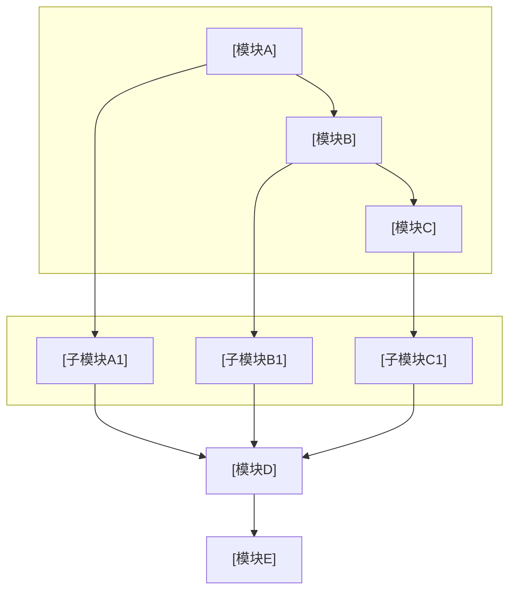
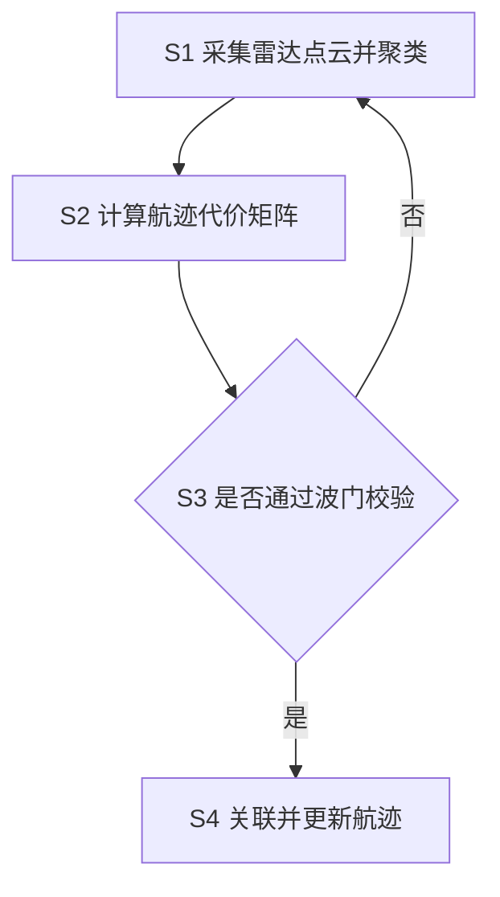

# 专利技术交底书模板参考（对齐所内 docx 模板）

本模板严格对齐 **`【参考】专利技术交底书模板.docx`** 的章节与字段结构（封面元数据表 + 一~六章），由 `disclosure_builder.md` 在 Step 7 引用。相比旧版「脱敏通用模板」，补齐了：**所属技术领域、3.3 业内克服缺陷的尝试、4.3 代替方案、4.5 技术效果逻辑论证、独立附图章**，并新增**案件管理元数据封面表**。

> 说明：docx 模板原文「4.2」出现两次（技术方案 / 代替方案），属编号瑕疵；本模板将后者编为 **4.3**，保持全文编号唯一。

---

## 封面：案件管理信息表

交底书正文**起始**即放此表（对应 docx 模板 Table 0）。字段多为填空性质——**身份证号、组织机构代码证、委托编号**等敏感/流程字段一律留 **`[待填写]`** 由提案人或知识产权人员手填，**Agent 不得主动编造或猜测**；仅「拟申报专利名称」由本案内容推出后填入。

```markdown
| 项目 | 内容 |
|------|------|
| 拟申报专利名称 | 一种XXX方法及系统 |
| 申报类型 | 发明 / 实用新型 |
| 委托编号 | [待填写] |
| 是否同日申请发明和实用新型 | 否 |
| 第一发明人·姓名 | [待填写] |
| 第一发明人·身份证号码 | [待填写] |
| 其他发明人 | [待填写] |
| 技术联系人·姓名 | [待填写] |
| 技术联系人·联系电话 | [待填写] |
| 技术联系人·电子邮箱 | [待填写] |
| 知识产权联系人·姓名 | [待填写] |
| 知识产权联系人·联系电话 | [待填写] |
| 知识产权联系人·电子邮箱 | [待填写] |
| 第一申请人·名称 | [待填写] |
| 第一申请人·组织机构代码证 | [待填写] |
| 第一申请人·地址、邮编 | [待填写] |
| 第一申请人·联系电话 | [待填写] |
| 委托日期 | [待填写] |
| 申请国家 | 中国 |
| 建议初稿完成日期 | [待填写] |
| 建议递交日期 | [待填写] |
| 备注 | [待填写] |
```

> 案件名规范化、时间戳后缀规则不变，见 `disclosure_builder.md` §7.3。

---

## 一、发明/实用新型名称

- 应为「XX装置」「XX系统」「XX方法」或「XX装置及XX方法」等
- **不超过 25 个字**
- 与封面表「拟申报专利名称」**逐字一致**（docx 模板要求：以案号为准，撰写过程会微调）

---

## 二、所属技术领域

- 写明本发明**所属的、或直接应用的**具体技术领域（如「车载毫米波雷达目标跟踪」「异构计算资源调度」）
- 一句话到一小段即可，**避免**在此展开技术细节（细节归第四章）
- **场景铺垫（建议，成 3–5 句一小段）**：①**场景与参与者**——用案件名称里的领域对象称呼执行主体，不要只用「系统/模块」代替；②**标题对象如何进入系统**——从本案材料归纳该对象如何被配置、调度或进入执行（材料没有则不编造固定机制）；③**高频术语各一句场景定义**——后文反复出现的领域词在此立住并全文同词。细则见 `disclosure_builder.md` §7.9

> 本章为 docx 模板要求、旧脱敏版所无；缺它会丢失「领域定位」信息。

---

## 三、背景技术

章首可放一段引导（创新三要素：现有技术存在缺陷 → 针对缺陷提出方案 → 方案解决缺陷，形成闭环），随后按 3.1/3.2/3.3 三节展开。

### 3.1 现有技术

- **检索说明**（置于 3.1 开头）：写**公开数据库名称**与**检索词**；**勿**写 `cnipa_epub_search.py` 等脚本名或「查新降级」等流程用语（见 `prior_art_search.md`「3.1 检索说明写法」）
- 内容须覆盖 docx 模板三点要求：①技术领域及应用情况 ②当前技术现状 ③**文件出处**（专利/论文，附公开源 URL）
- 按**技术方向**分类列举；每条含：专利号/文献标识、申请方或来源、技术方案、应用场景、**局限性**、**公开源 URL（必填）**
  - **国知局 `abstract`**：若 Step 5 JSON 含 `abstract`，该条叙述**必须先充分理解摘要后再概括**（见 `prior_art_search.md`）；正文**勿**大段粘贴官方摘要全文
  - **URL 要求**：每条**至少一个**可公开访问链接，**写入前验证**有效且与著录项一致；**禁止虚构链接**
- 结尾：检索总结 + **本发明与现有技术的本质区别**

### 3.2 现有技术存在的问题（= 本发明创造的灵感来源）

- **实事求是**指出现有技术因某些问题/缺点，导致在**技术效果、生产效率、功能结构**上存在缺失——这正是发明人改进的动机
- 着重说明**本发明需要改进的缺陷**，并分析这些问题存在的原因
- docx 模板要求**不少于 100 字**；与 3.1 局限性、4.1 要解决的问题呼应
- 本发明**未涉及**的缺陷不必列；与理解本发明无关的背景技术无需提供

### 3.3 业内克服现有技术缺陷的尝试

> 本章为 docx 模板要求、旧脱敏版所无；是查新差异化的**关键章节**，与 3.1 互补。

- 描述**国内外同行**对该缺陷是否有过改进尝试；若有，他们一般采用什么**结构或方法**来克服
- **详细列明**并**提供文件出处**（专利/论文 + 公开源 URL），以及对这些改进措施的**看法**（为何仍不足以解决、或存在何种新问题）
- 与 3.1 的分工：3.1 偏「最接近的现有技术现状」，3.3 偏「同行针对**同一缺陷**的改进路线」；二者均可来自 Step 5 查新，按侧重分流
- docx 模板要求**不少于 100 字**；本发明未涉及的缺陷不必列

---

## 四、创新点

章首引导（docx 原文要点）：指出发明改进后的**具体技术方案**，清楚、完整、准确，尤其要把**区别于现有技术的发明点**描述清楚，而不仅是基本原理；描述应达到**本专业 2-3 年实务经验的大学毕业生能据此直接制造实现**为准；描述每项技术手段（含结构位置与连接关系）时，相应说明其在本发明中所起的作用。

> **技术隐藏与模糊化**（docx 原文要求）：向代理人交底时**不需要做技术隐藏**，应详尽说明；如不希望在申请文件中公布或希望模糊化处理的部分，**在文中标注**告知代理人，由其统一权衡。Agent 据此：用户明示需模糊化的，就地标注「【建议模糊化】」并简要说明，**不擅自删改技术事实**。

### 4.1 要解决的技术问题

- 背景技术的缺陷**一般就是**本申请要解决的技术问题（本申请是对背景技术缺陷提出的技术方案）
- 与 3.2 缺点逐条对应

### 4.2 为解决技术问题而采取的技术方案（详细描述技术改进点）

技术方案是发明为解决技术问题而采取的**技术手段的集合**，是专利申请的**核心**。把区别于现有技术的技术手段（**发明点**）尽可能描述清楚，并针对发明点做**原理说明**，阐述为什么能解决技术问题；描述要求达到**本领域技术人员不经过创造性劳动即能理解、实现**为准。可替代的技术手段、方法步骤也要尽量提出，以便在权利要求书中以**从属权利要求**形式保护。

按产品类型描述要点（docx 原文）：
- **机械产品**：必要零部件及整体结构关系
- **电路产品**：电路连接关系
- **机电结合**：电路与机械部分的结合关系
- **分布参数**：元器件相互位置关系
- **方法**：各步骤/流程

docx 模板要求**不少于 200 字**。本节用以下子节组织（含图示与公式时）：

#### 4.2.1 系统框图

- 使用 **fenced mermaid**（推荐 `flowchart TB`/`LR` + `subgraph` 分层）
- **节点名用标题领域对象与场景短词**；避免公司名、产品名、内部代号。**禁止**为「抽象通用」把标题对象换成更空的上位词（「资源画像」→「节点数据」；「数字员工」→「岗位集群」）。实现字段不要堆进标签
- 定稿交付前经 `tools/mermaid_render.py` 转 PNG 并**默认**生成 Word；**不需要**再附 ASCII 文字框图（Word 中以图为准）
- 布局层次清晰；复杂时可拆多张 mermaid

**mermaid 系统框图模版**（替换标题与模块名、连线）：



#### 4.2.2 模块功能说明

**重点**：各模块的**作用**与**模块间关联关系**（专利不强调输入输出）。

- 作用：该模块在整体方案中的角色
- 关联关系：上下游依赖、数据流/控制流、闭环关系
- docx 原文要求：描述每项技术手段时相应说明其在本发明中所起的作用
- **一模块一项**：按 4.2.1 框图节点拆成**独立条目**（作用 + 关联），不要把多个框图节点揉进一条
- 模块名、执行主体、资料/交付物名称与**二、所属技术领域 / 4.2.1 框图**同词，且属于本专利话题；不要把另一领域的行话当模块术语

#### 4.2.3 系统流程说明

##### 流程图

- 使用 **fenced mermaid** 代码块；**不要** ASCII 文字/箭头流程图
- 定稿交付前用 `tools/mermaid_render.py` 转 PNG 并**默认**生成 Word；失败时按终端提示用 `md_to_docx.py` 手动转换
- **可见步骤号**：节点 id（`S1`）**不会**出现在 PNG 上，标签里要写出 S1/S2。正例：`S1["S1 采集节点指标"] --> S2["S2 滑动平滑生成画像"]`；反例：`S1[识别教师指令对应的教学活动]`（PNG 没有 S1）。判断节点同理：`S5{"S5 是否达阈"}`
- 步骤标签用**标题领域对象与场景短词**（与 4.2.1 同一套名字），不要换成更空的上位词
- **公式无需渲染为图片**：`md_to_docx.py` 内置 LaTeX → OMML 转换器，公式自动转为 Word 原生公式（可编辑、矢量清晰）

**mermaid 流程图模版**（替换步骤名；id 与标签均含序号）：



##### 流程说明

- 用文字**按步骤号逐项**说明 S1—Sn（与图中节点一一对应，**不替代**流程图图示）。步骤里须让**标题领域对象做事**，不能只在第二章出现一次，也不能几步合并成一段而不点步骤号
- 术语与第二章领域词同词；需要强调如何判定时，括号内写白话机制，仍不要改回错位行话
- 流程涉及算法、评分、约束或形式化变量时，在 **4.2.4** 集中给出符号定义与主公式；须**先完成 `formula_plan.yaml`**（范式选自 `references/formulas/paradigms.yaml`），并遵守 `disclosure_builder.md` §7.7

#### 4.2.4 符号与公式

**撰写顺序**：**`formula_plan.yaml`（选题 + 数值例，见 `disclosure_builder.md` §7.7「成文前 formula_plan」）** → 符号与变量定义 → 核心公式（含式 (1)，可另列触发式 (2)）→ 文字解释与流程衔接。

列出可用范式：`python tools/formula_paradigms.py list`。组合示例见配置中 `combos`（如 `match_then_rate_limit`）。

##### 符号表示例（Markdown 正文可直接采用）

```markdown
#### （1）任务侧符号

| 符号 | 含义 | 下标/量纲 |
|------|------|-----------|
| \(i\) | 任务索引 | \(i=1,\ldots,N\) |
| \(b_{i,\mathrm{cpu}}\) | 任务 \(i\) 的 CPU 需求权重 | 无量纲，\(b_{i,\mathrm{cpu}}>0\) |
| \(b_{i,\mathrm{mem}}\) | 任务 \(i\) 的内存需求权重 | 同上 |

#### （2）节点侧符号

| 符号 | 含义 | 下标/量纲 |
|------|------|-----------|
| \(j\) | 计算节点索引 | \(j=1,\ldots,M\) |
| \(A_{j,\mathrm{cpu}}\) | 节点 \(j\) 平滑后的 CPU 可用比例 | \([0,1]\)（由原始 \(a\) 经滑动平均得到，**不用** \(\tilde{a}\)） |
```

##### 公式正/反例（体例必遵）

| 场景 | ✅ 推荐 | ❌ 避免 |
|------|---------|---------|
| CPU 维度权重 | \(b_{i,\mathrm{cpu}}\) | \(b_i^{cpu}\)（上标易被读作幂次） |
| 平滑画像 | \(A_{j,\mathrm{cpu}}\) + 文字说明 | \(\tilde{a}_{j,\mathrm{cpu}}\)（装饰音，Word 易渲怪） |
| 节点饱和度 | \(a_{j,\mathrm{cpu}} \le 0\) | \(a_j^{cpu} \le 0\) |
| 多维度并列 | \(b_{i,\mathrm{cpu}},\, b_{i,\mathrm{mem}}\) | \(b_i^{cpu}, b_i^{mem}\) |
| 选题 | 范式库 `weighted_sum_unit` + `dual_threshold` | 未登记的巨型单式、量纲混乱硬凑 |
| 块级主公式 | `\[ M_{ij} = \alpha b_{i,\mathrm{cpu}} + \beta a_{j,\mathrm{cpu}} \tag{1} \]` 单行 | 块内多行 `\\` 换行堆叠（渲染易失败） |
| 逻辑连接 | 公式外写「且 \(a_{j,\mathrm{mem}}\le 0\)」 | 公式内 `\text{且}` |
| 防零除 | \(\max(\varepsilon, b_{\mathrm{mem}})\)，\(\varepsilon\) 同量纲 | \(\max(1, b_{\mathrm{mem}})\) 且 \(b\) 为 MB |

**行内/块级分隔符**：全文统一 `\(...\)` / `\[...\]` **或** `$...$` / `$$...$$` 二选一；与 `disclosure_builder.md` §7.7 一致。

#### 4.2.5 关键技术参数

- 置信度/阈值类：含义、取值范围
- 算法参数：公式、约束条件
- 参数表须设 **「符号」列**，与 **4.2.4 符号表逐字同形**（勿在 4.2.5 改用 `^{cpu}` 而上文用下标）
- 表内中文参数名与**第二章领域术语**同词；需要写清判定时用「领域名（如何判定/如何记录）」，不要另起一套与话题不符的行话
- 确保与正文公式、实施例数值一致（有 `formula_plan.yaml` 时与 `numeric_example` 可互相印证）

### 4.3 本发明技术方案的代替方案（不同构思的解决方案，有则填写）

> 本章为 docx 模板要求、旧脱敏版所无；目的是**扩大保护范围**。

- 发明人提供的克服方案中，**哪些技术手段可以用其他手段替换**
- 即使替代方案效果不如首选方案、或不如适合工厂生产，只要能**实现发明目的**，就应列出（以便写入从属权利要求）
- 给出**替代结构/方法**及其**等效作用**的简要说明（例：滤波电路 → 滤波器；整流+采样电路 → 控制芯片 A）
- 无替代方案时写「本技术方案各手段不可替代」或「暂无不同构思的替代方案」，**勿**为凑数编造

### 4.4 本发明解决技术问题的有益效果/进步效果

- 描述本发明解决的**技术问题或缺陷**，以及与现有技术相比的**有益效果/进步效果**
- 可涵盖：产率、质量、精度、效率的提高；能耗、原材料、工序的节省；加工、操作、控制、使用的简便；环境污染的治理；有用性能的出现等
- 与 3.2 缺点、4.1 问题**闭环呼应**

### 4.5 本发明技术效果的逻辑论证

> 本章为 docx 模板要求、旧脱敏版所无；从技术角度论证「为什么能克服缺陷」。

- 从技术角度分析**为什么本发明能克服现有技术缺陷**
- 说明各技术要素之间**如何协同发挥作用**，产生上述有益效果
- 如有**实验室数据/实测数据**则更好（提供则注明来源与条件）
- docx 模板要求**不少于 100 字**；与 4.2 技术方案、4.4 效果形成「方案→效果→论证」逻辑链

---

## 五、发明技术方案的具体实施方式

实施例是实施发明内容的**具体例子**，可有多个；举一个具体的实现事例，将发明内容体现出来。

- **产品类**：描述机械构成、电路构成或化学成分，说明各部分相互关系；可动作产品还应说明动作过程或操作步骤
- **方法类**：写明步骤，包括可用不同参数或参数范围表示的工艺条件
- **至少提供一个实施例**，且建议与所保护的技术方案对应描述；建议 **2～3 个有名字的实例**，名称与第二章 / 4.2.1 框图相同
- **角色齐**：实例须带职责、可调用能力（工具/资料范围）、交付物、相互依赖；不要只列模块名
- **路径齐**：至少走完**主路径 + 一条第四章已有的分支**（以 4.2.3 流程分支为准）；实施例是把标题对象走成可想象的业务故事，不是 4.2.3 的缩写复述
- **技术效果**：量化或定性说明；**参数设置示例**注明「不作为权利要求限制」，有公式时与 4.2.5 / `formula_plan.numeric_example` 一致
- 附图中出现的部件标号或流程标号，必须在第四章技术方案中给予解释和说明

```markdown
### 实施例1
（详细描述必要的步骤或结构；有附图的，指明具体附图序号）

### 实施例2（有则填写）
（……）
```

撰写要求（docx 原文）：
1. 发明技术方案必须**完整**，技术描述必须**清楚**
2. 尽可能多地提供本发明的各种**扩展技术方案**
3. 附图中出现的部件标号或流程标号必须在技术方案中给予**解释和说明**

---

## 六、发明附图及说明

> 本章为 docx 模板要求；旧脱敏版将附图散在 3.2/3.4。本模板独立成章，便于代理人按序核对。

- 附图须为**二维黑白线条图**（结构示意图，而非工程图），能清楚体现**发明点**所在；统一**编号并命名**
- 技能产出路径：第四章 4.2.1/4.2.3 的 mermaid 已由 `tools/mermaid_render.py` 渲染为 PNG，本章**汇总列出**所有附图并作**简要说明**
- docx 原文「发明专利申请一定要有附图」——本技能默认附图（mermaid 框图/流程图）

撰写要求（docx 原文）：
1. 写明各幅附图的**图名**，并对图中标明的各部件作简要说明；附图用 Word 编辑附在交底书后
2. 发明专利申请**一定要有附图**
3. 对附图简要说明，例如「图1 为 XXX 装置的主视图」「图2 为 XXX 流程图」
4. 表示同一组成部分（同一技术特征或同一对象）的附图标记应当**一致**
5. 附图中出现的部件标号或流程标号必须在技术方案中给予**解释和说明**

**附图汇总表（建议置于本章首）**：

```markdown
| 图号 | 图名 | 来源章节 |
|------|------|----------|
| 图1 | XXX 系统框图 | 4.2.1 |
| 图2 | XXX 流程图 | 4.2.3 |
```

---

## 脱敏 / 模糊化检查表

docx 模板允许并鼓励对**不便公开的部分做模糊化处理**（标注后由代理人统一权衡）。下列项**默认可保留真实信息**（因本模板面向所内正式交底）；用户明示需保护的业务敏感项按表处理并在文中**就地标注**：

| 检查项 | 默认 | 需保护时 |
|--------|------|----------|
| 业务/行业名称 | 保留真实 | 抽象为通用描述 + 标注【建议模糊化】 |
| 具体分类标签 | 保留真实 | 分类A/B/C + 标注 |
| 具体数值/参数 | 保留真实（写进 4.2.5） | 范围/示例值 + 标注「不作为权利要求限制」 |
| 公司/产品名 | 保留真实 | 删除或「某系统」+ 标注 |
| **标题领域对象、实施例角色与交付物类型** | **不模糊化抽掉**；只去掉真实主体名 | —— |
| 身份证号/组织机构代码/委托编号 | **始终** `[待填写]` | 不由 Agent 填 |

---

## 标题贯穿与术语检查（成文时对照）

- 案件名称中的领域实词，能否在 **4.2.1 框图、4.2.3 流程、第五章实施方式**指到同一个执行主体？
- 离开本案标题与第二章场景，4.2.2 / 4.2.5 / 第五章的用词会不会像另一技术领域？若会，整族换成领域表述，不要靠补定义保留（正/反例见 `disclosure_builder.md` §7.9）。
- 换过术语的，3.1 至第六章及 mermaid 是否已整族替换？

---

## 交付正文禁忌（勿写入交底书）

- **禁止**在全文任意位置（尤其**文末**）加入技能仓库、示例仓库、`customize-patent-disclosure-skill`、`examples/` 路径、「教学/虚构示例」「不构成法律或技术承诺」等**元脚注**；交付物视为正式技术交底书文稿，**止于第六章及此前章节**。
- **禁止**交底书正文中包含「自检清单」章节。

---

## 公式与参数一致性检查

- 全文公式表述统一（如：置信度权重、密度调整系数）
- **选题**：主式来自 `references/formulas/paradigms.yaml`；案件有 `formula_plan.yaml` 且数值例可算（`check_formula_plan.py --eval` 通过或等价手检）
- **符号体例**：资源维度用下标 `_{\mathrm{cpu}}` 等，**无** `^{cpu}`/`^{mem}` 类上标维度写法；**无** `\tilde`/`\hat`/`\bar` 装饰音
- **符号表完整**：4.2.4 已定义符号；式 (1) 及后文每个符号均在表中出现；**无**同一字母多义
- **公式正确性与逻辑**：各式无笔误；不等式方向与文字一致；公式与 4.2.3 流程/4.2.2 模块可互推；边界情形不矛盾；相加各项无量纲/归一；防零除 \(\varepsilon\) 与分母同量纲
- **跨节同形**：4.2.4、4.2.5「符号」列、第五章实施例与正文公式 **逐字一致**
- 阈值范围一致（如 0.5–1.5、0.8–1.2）
- 参数命名统一（避免同义不同名混用；公式符号与**场景术语**分开查：场景词换名须整族替换）
- LaTeX 分隔符全文统一（`\(...\)`/`\[...\]` 或 `$`/`$$` 二选一）
- 实施例数值与 4.2.5 节及 `formula_plan.numeric_example` 对应
